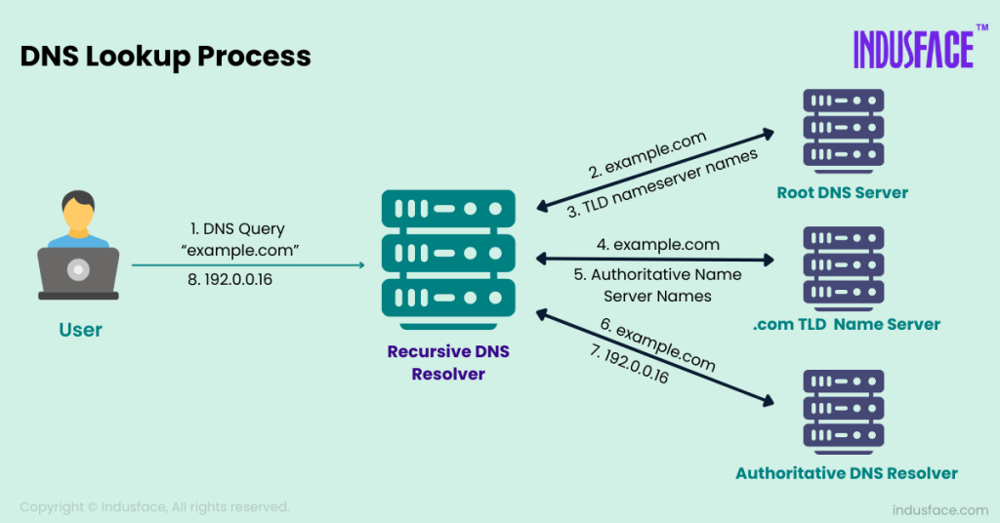


# El ecosistema DNS (OSINT y Web) [2p]

El sistema DNS es una estructura jerárquica a nivel mundial. Para administrar redes, primero debemos entender quién gestiona cada parte del pastel.

## Investigación de Jerarquía:
* ¿Qué organismo internacional coordina y asigna los parámetros a nivel global del sistema de nombres de dominio e IPs?
```ini
[Respuesta]: El organismo encargado a nivel global es la ICANN (Internet Corporation for Assigned Names and Numbers), que trabaja junto a la IANA para gestionar y organizar las direcciones IP y la zona raíz del DNS en todo el mundo.
```
* ¿Qué empresa u organismo gestiona (Registry) cada uno de los siguientes dominios de nivel superior (TLD)?
  * `.es`
  * `.cat`
  * `.edu`
  * `.ifp.es`
```ini
[Respuesta .es]: Red.es (Entidad pública empresarial adscrita al Ministerio de Transformación Digital en España)
[Respuesta .cat]: Fundació .cat (Entidad privada sin ánimo de lucro dedicada a promover la lengua y cultura catalana)
[Respuesta .edu]: Educause (Organización sin fines de lucro enfocada en la educación superior en EE. UU.)
[Respuesta .ifp.es]: Grupo Planeta (No es un TLD oficial, sino un subdominio privado bajo el dominio .es)
```
[Base de datos oficial de la IANA](https://www.iana.org/domains/root/db?utm_source=gemini)

[Información de Dominio - Red.es](https://www.dominios.es/es )

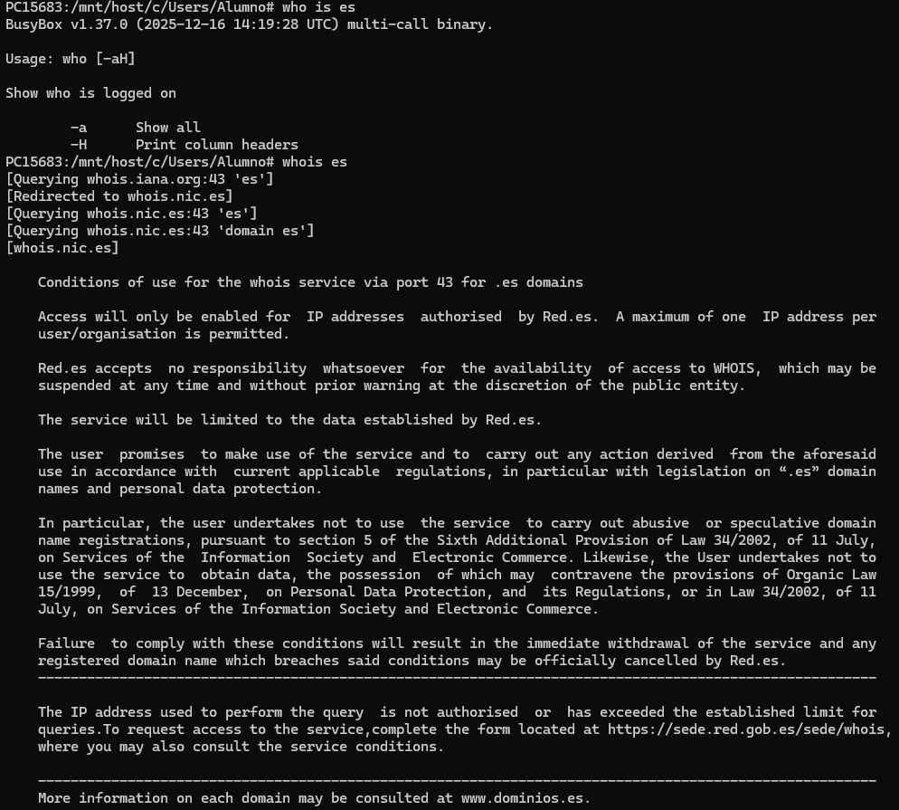

## Herramientas OSINT (Whois y DNS Lookup): 
Utiliza herramientas online (como Dominios.es, whois.com, nslookup.io) para responder a lo siguiente:
* ¿Qué información te brinda una consulta Whois sobre un dominio?
```ini
[Respuesta]: Muestra la ficha del dominio: quién es el dueño o empresa registradora, cuándo se compró, cuándo caduca, si está activo y qué servidores DNS utiliza.
```
* Define brevemente la diferencia entre el Registry de la base de datos y el Registrar (Registrador) del dominio.
```ini
[Respuesta]: El Registry es la entidad que gestiona y controla una extensión de dominio completa (por ejemplo, Red.es para los .es). El Registrar es la empresa o tienda (como GoDaddy) que actúa como intermediaria para que un usuario pueda comprar ese dominio.
```
* Investiga: ¿Qué es DNSSEC y qué problema de seguridad intenta resolver en las resoluciones DNS?
```ini
[Respuesta]: DNSSEC es un sistema de seguridad que usa firmas digitales para confirmar que la dirección IP que nos da el DNS es la correcta. Sirve para evitar que un atacante modifique la respuesta y nos dirija a una página web falsa.
```
## Rendimiento DNS: 
Ve a la web de GRC DNS Benchmark.


1. Descarga e inicia la aplicación (no requiere instalación).
2. Ejecuta el test para comprobar cuáles son los servidores DNS más rápidos desde tu ubicación.
3. Selecciona los 3 servidores más rápidos de la lista, anota sus IPs y argumenta brevemente de qué empresas son. (Los utilizarás en la siguiente fase).

```ini
[Respuesta 1º Servidor]: 199.85.127.10 (DNS 2: 199.85.126.10) - Pertenece a Norton ConnectSafe. Es un servicio de DNS centrado en la seguridad que filtra software malicioso y páginas peligrosas.
[Respuesta 2º Servidor]: 9.9.9.10 (DNS 2: 149.112.112.10) - Pertenece a Quad9 (versión sin filtrado de seguridad). Es gestionado por una organización sin ánimo de lucro orientada a la velocidad y privacidad.
[Respuesta 3º Servidor]: 45.90.30.230 (DNS 2: 45.90.28.230) - Pertenece a NextDNS. Es un proveedor de DNS moderno enfocado en la privacidad y la personalización del bloqueo de anuncios y rastreadores.
```
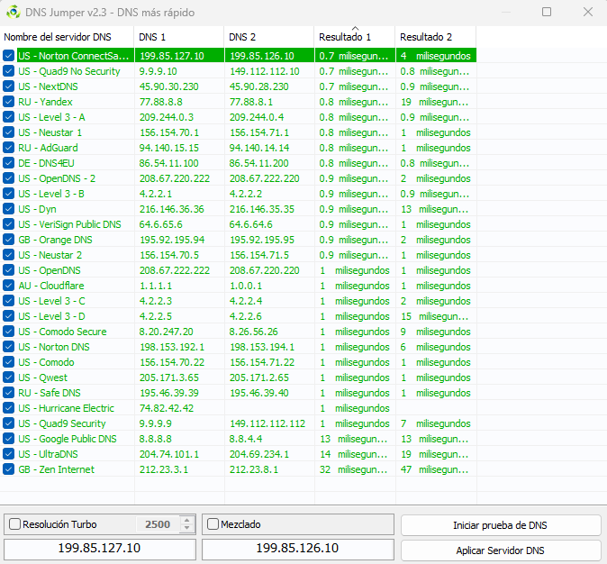

---

# Configuración y Caché [2p]

Todo sistema operativo guarda las resoluciones DNS para no saturar la red.

## Cambio de servidores DNS:
* ¿Cómo puedes ver mediante consola (CLI) qué servidores DNS tienes asignados actualmente en Windows y en Linux?
```ini
[Respuesta Windows]: En la consola (CMD o PowerShell) ejecutas el comando "ipconfig /all". Buscas el apartado de la tarjeta de red activa en la línea "Servidores DNS".
[Respuesta Linux]: En la terminal ejecutas "cat /etc/resolv.conf" o el comando "resolvectl status". En las líneas marcadas como "nameserver" o "DNS Servers" se ve las IPs configuradas.
```
* Cambia la configuración de red de tu equipo principal (Windows o Linux) poniendo como DNS primario y secundario los que obtuviste en el Benchmark de la Fase 1. Muestra captura del cambio.
```ini
[Respuesta]: Se ha modificado la configuración de red en el equipo principal asignando como DNS primario la IP 199.85.127.10 y como DNS secundario la IP 199.85.126.10, correspondientes al servidor más rápido obtenido en el test de DNS Benchmark.
```
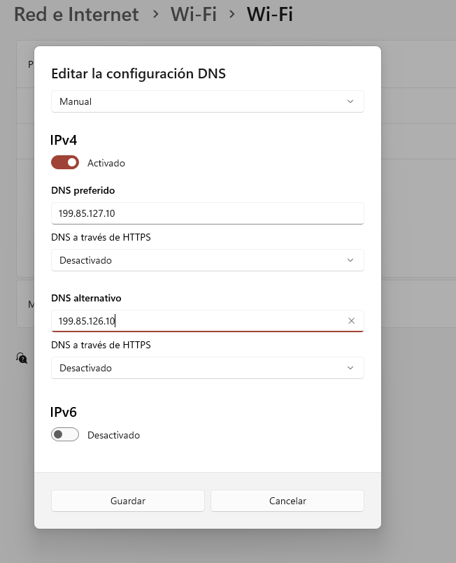

* ¿En qué menú de tu dispositivo móvil (Android/iOS) podrías forzar el uso de unos DNS específicos para tu conexión Wi-Fi?
```ini
[Respuesta Android]: Se accede desde "Ajustes > Redes e Internet (o Wi-Fi)", se pulsa en el icono de rueda dentada de la red conectada, se selecciona "Modificar red > Opciones avanzadas", se cambia el Ajuste de IP a "Estática" y se introducen las IPs en los campos DNS 1 y DNS 2.
[Respuesta iOS]: Se entra en "Ajustes > Wi-Fi", se toca el icono de información (i) junto a la red Wi-Fi activa, se entra en "Configurar DNS", se cambia a modo "Manual" y se añaden los servidores con la opción "Añadir servidor".
```

## Gestión de la caché DNS (ipconfig / resolvectl):
* Utilizando tu terminal de Windows (`ipconfig /displaydns`) o Linux (`resolvectl statistics` o similar): Muestra una captura de pantalla de algunas direcciones almacenadas en la caché de tu equipo.
```ini
[Respuesta]: Al ejecutar el comando "ipconfig /displaydns" en la consola de Windows, el sistema muestra el historial de nombres de dominio resueltos recientemente que permanecen guardados en la memoria caché local junto con su registro A (dirección IP) y su tiempo de vida (TTL).
```
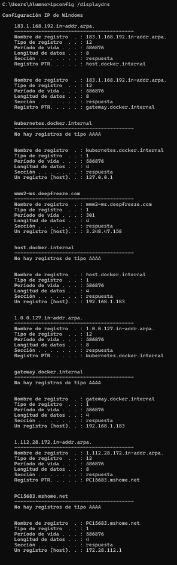

* Vacía la caché de tu equipo (`ipconfig /flushdns` o `resolvectl flush-caches`). Explica para qué es útil esta acción en el día a día de un administrador de sistemas.

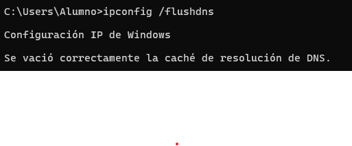

---

# Administración - Troubleshooting con DIG y CLI [3p]

En un entorno profesional, especialmente servidores Linux, la herramienta `nslookup` se considera obsoleta, siendo `dig` - Domain Information Groper - el estándar de la industria.

## Consultas específicas de registros (Usa dig en Linux o WSL):
Documenta con capturas de pantalla y explica el resultado de ejecutar las siguientes consultas sobre el dominio `aliexpress.com` u otro de tu elección:
* **A:** `dig aliexpress.com` - Analiza la sección ANSWER SECTION).
```ini
[Respuesta]: En la sección ANSWER SECTION se devuelven dos registros de tipo A para "aliexpress.com", resolviendo a las direcciones IP públicas 47.246.111.53 y 47.246.75.137. Ambos registros cuentan con un tiempo de vida en caché (TTL) de 137 segundos en la clase de red IN (Internet).
```
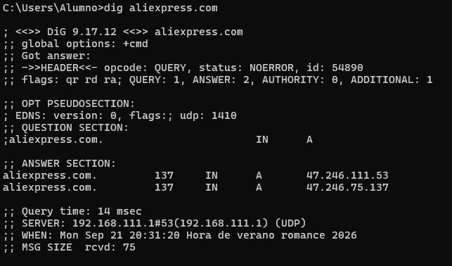

* **Short:** `dig +short aliexpress.com` - ¿Por qué es útil este formato en scripts de Bash?
```ini
[Respuesta]: La opción "+short" sirve para limpiar la pantalla y mostrar únicamente el dato importante (las IPs). Es muy útil cuando creas programas o scripts en Bash porque te da la IP directa y te evita tener que usar otros comandos para limpiar todo el texto sobrante.
```
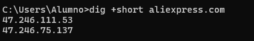

* **MX:** `dig MX aliexpress.com` - Identifica el campo de Prioridad/Preference de los servidores de correo.
```ini
[Respuesta]: En la sección ANSWER SECTION se observa que el servidor de correo devuelto es "mx2.mail.aliyun.com" con un valor de prioridad de 10 ("10 mx2.mail.aliyun.com"). En las consultas MX, este número indica la preferencia de entrega, siendo los valores numéricos más bajos los que tienen mayor prioridad para gestionar el correo.
```
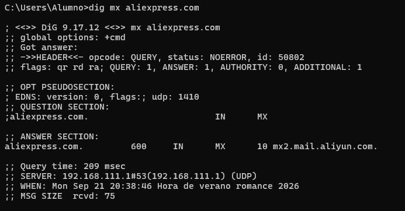

* **NS:** `dig NS aliexpress.com` ¿Cuáles son los servidores que tienen la autoridad sobre las zonas de este dominio?
```ini
[Respuesta]: En la sección ANSWER SECTION se obtienen dos servidores autoritativos para "aliexpress.com": "ns1.alibabadns.com" y "ns2.alibabadns.com". Estos servidores guardan la base de datos oficial del dominio y son los encargados de responder con autoridad sobre sus zonas y registros.
```
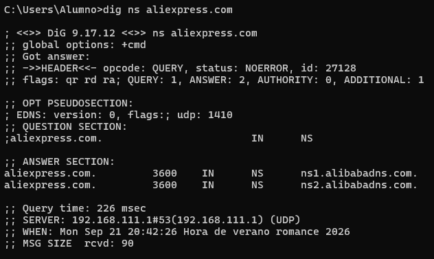

## Autoridad y Caché (TTL):
* ¿Qué diferencia existe entre un registro SOA (Start of Authority) y un registro NS (Name Server)?
```ini
[Respuesta]: El registro NS identifica cuáles son los servidores de nombres autoritativos encargados de delegar y responder sobre una zona DNS. Por otro lado, el registro SOA define los parámetros administrativos y técnicos globales de dicha zona (como el servidor maestro principal, el correo del administrador, el número de serie para sincronizaciones y los tiempos de expiración y reintento de la zona).
```
* Realiza una consulta a un dominio cualquiera. Observa el valor TTL (Time To Live). Vuelve a realizar la consulta a los 5 segundos. ¿Qué ha pasado con el valor numérico del TTL? ¿Qué nos demuestra esto sobre el origen de la respuesta (Caché vs Servidor Autoritativo)?
```ini
[Respuesta]: En la captura se observa que en la primera consulta el TTL del registro SOA era de 2623 segundos, y al repetir el comando 6 segundos después (a las 20:50:05), bajó a 2617 segundos. Esta reducción confirma que la respuesta proviene de la memoria caché del servidor local (que descuenta el tiempo transcurrido) y no del servidor autoritativo original, el cual devolvería siempre el TTL integro. Además, la segunda respuesta tardó 0 msec en responder, reafirmando que ya estaba guardada en caché.
```
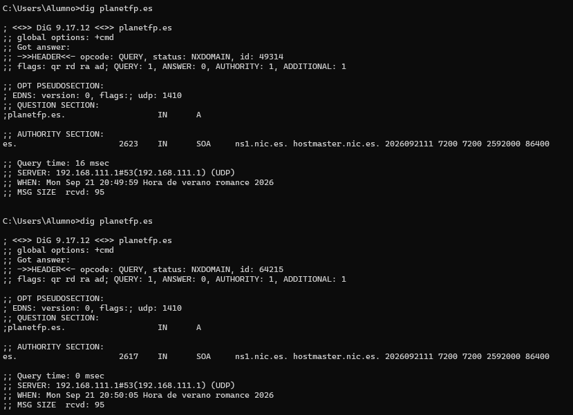

## Trazabilidad Completa (Trace):
Ejecuta el comando: `dig +trace aliexpress.com`
Muestra la captura y explica paso a paso cómo tu ordenador contacta primero con los Root Servers (`.`), luego con los servidores del TLD (`.com`) y finalmente con los servidores autoritativos del dominio.
```ini
[Respuesta]: Tras completar el análisis y la resolución de nombres DNS, se extraen las siguientes conclusiones principales:

1. Protocolos y Capa de Transporte:
   DNS utiliza por defecto el protocolo UDP en la capa de transporte debido a su rapidez y bajo consumo de recursos, reservando el puerto 53 para las comunicaciones entre cliente y servidor.

2. Identificación y Seguridad de Consultas:
   El identificador de transacción (Transaction ID) es clave para emparejar cada respuesta del servidor con su petición original, garantizando la integridad del proceso frente a posibles respuestas duplicadas o no solicitadas.

3. Jerarquía y Mecanismos de Caché:
   Las banderas (Flags) como "Authoritative Answer" permiten distinguir si la respuesta proviene del servidor dueño de la zona o de la memoria caché de un servidor recursivo. El descuento progresivo del tiempo de vida (TTL) confirma visualmente la eficiencia del sistema de caché local.

4. Herramientas Diagnósticas (DIG vs Nslookup):
   El comando `dig` se consolida como la herramienta estándar en entornos profesionales. Permite inspeccionar registros específicos (A, MX, NS) de forma detallada y trazar de manera iterativa (`+trace`) la jerarquía DNS global desde los servidores raíz hasta los autoritativos.
```
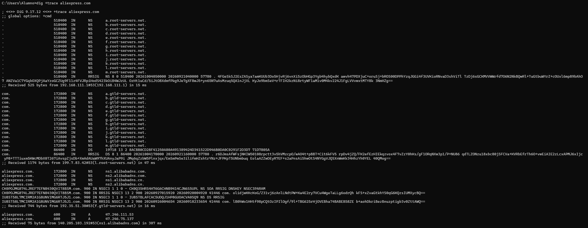

---

# Análisis de Tráfico de Red (Wireshark) [3p]

Vamos a comprobar qué viaja realmente por el cable físico cuando resolvemos un nombre.

1. Abre Wireshark en tu equipo y empieza a capturar tráfico en tu tarjeta de red principal.
   
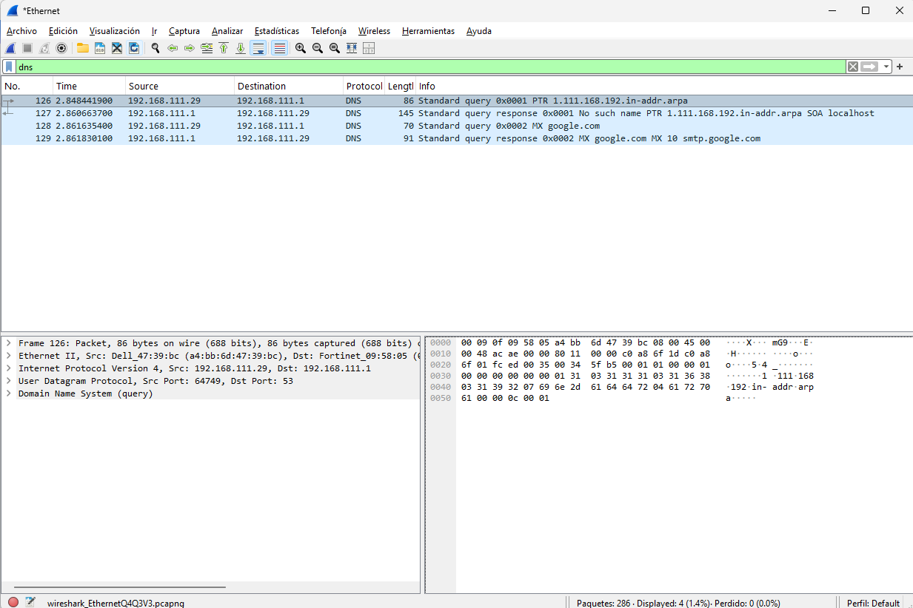

2. Aplica el filtro de captura o visualización para aislar solo el tráfico DNS (`udp.port == 53` o simplemente `dns`).

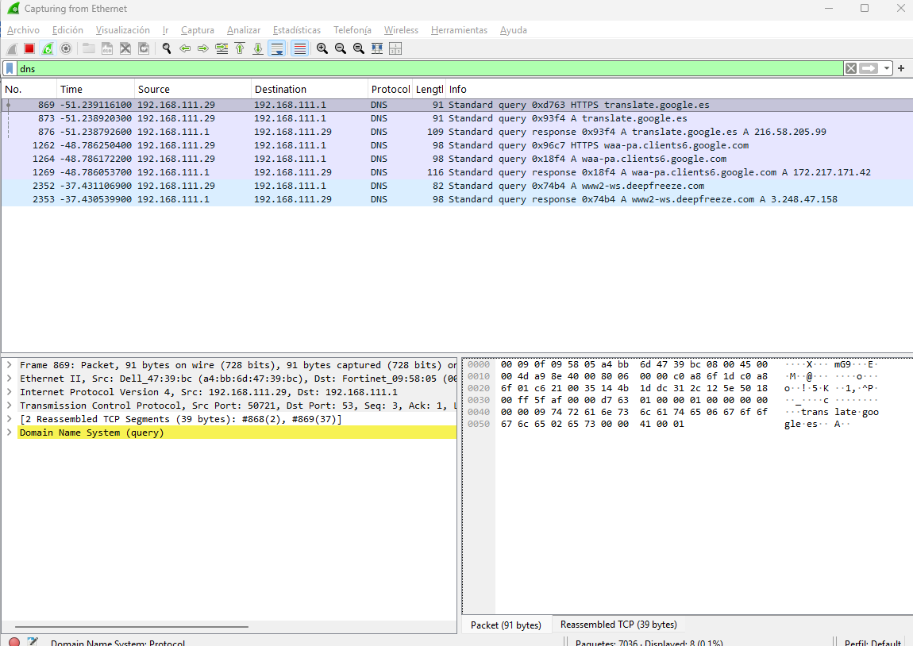

3. Abre una terminal y fuerza una consulta específica, por ejemplo: `nslookup -type=mx google.com`
4. Detén la captura, localiza el intercambio exacto de la Petición (Query) y la Respuesta (Response), y responde a las siguientes preguntas justificando siempre con recortes de pantalla del panel de detalles de Wireshark:

   * **Capa de Transporte:** ¿Qué protocolo se utiliza (TCP o UDP)? ¿Por qué DNS utiliza este protocolo por defecto en lugar del otro?
   ```ini
   [Respuesta]: Se utiliza el protocolo UDP (User Datagram Protocol). DNS lo usa por defecto porque es un protocolo muy rápido y ligero que no requiere establecer una conexión previa (handshake), ideal para resolver nombres en milisegundos con un consumo mínimo de red.
   ```
   * **Puertos:** Identifica el puerto de origen (dinámico) del cliente y el puerto de destino (conocido) del servidor.
   ```ini
   [Respuesta]: El puerto de origen del cliente es el 64750 (un puerto dinámico asignado por el equipo para esta consulta concreta) y el puerto de destino del servidor DNS es el 53 (puerto estándar en el servidor para resolver DNS).
   ```
   * **Identificador:** Expande la sección Domain Name System. ¿Qué identificador de transacción (Transaction ID) vincula la respuesta del servidor con la petición de tu cliente?
   ```ini
   [Respuesta]: El Transaction ID que vincula la respuesta con la petición es el 0x0002. En el panel inferior se observa la sección "Domain Name System (query)" desplegada mostrando "Transaction ID: 0x0002", el cual coincide entre el paquete de consulta nº 128 y el paquete de respuesta nº 129.
   ```
    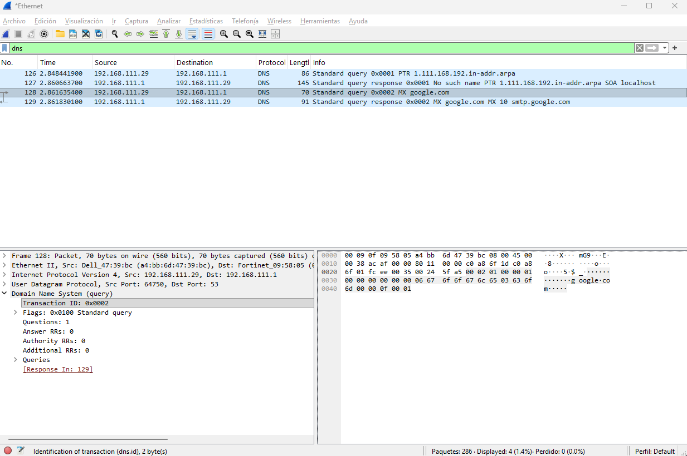
   
   * **Flags:** En el paquete de Respuesta, despliega la sección Flags. Busca la opción Authoritative Answer. ¿Está a 0 o a 1? ¿Qué significa esto?
  ```ini
   [Respuesta]: La opción Authoritative se encuentra a 0 (".... .0.. .... .... = Authoritative: Server is not an authority for domain"). Esto significa que el servidor DNS que ha respondido no es el servidor autoritativo original de "google.com", sino un servidor DNS intermedio o recursivo que ha obtenido la respuesta desde su memoria caché o consultando a otros servidores.
  ```
  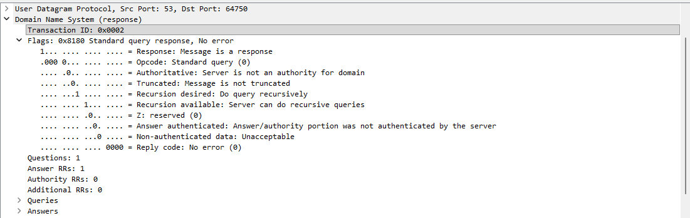

   * **Respuestas (Answers):** Despliega el bloque de respuestas. ¿Qué servidor de correo de Google tiene la prioridad (preference) más alta (el número más bajo)?
  ```ini
  [Respuesta]: El servidor devuelto en el bloque de respuestas es "smtp.google.com" con un valor de prioridad de 10 ("preference 10"). En los registros MX, el número más bajo representa la mayor prioridad, por lo que este es el servidor principal encargado de recibir el correo del dominio.
  ```
  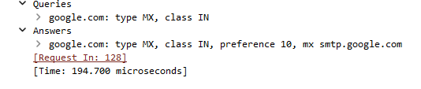

 
