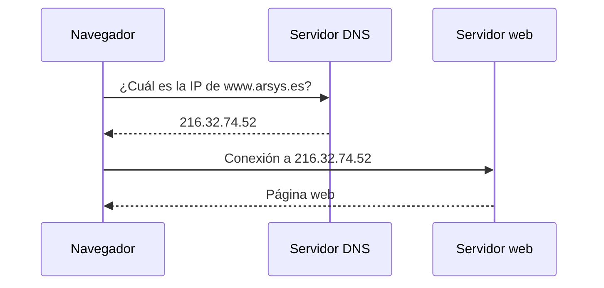
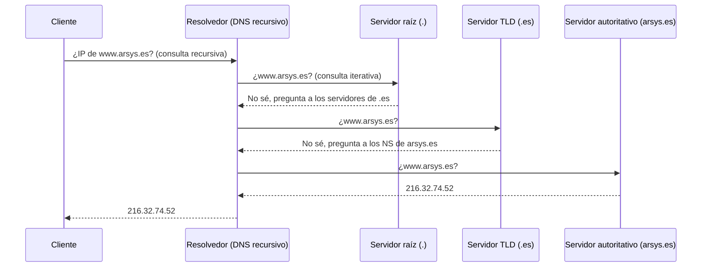
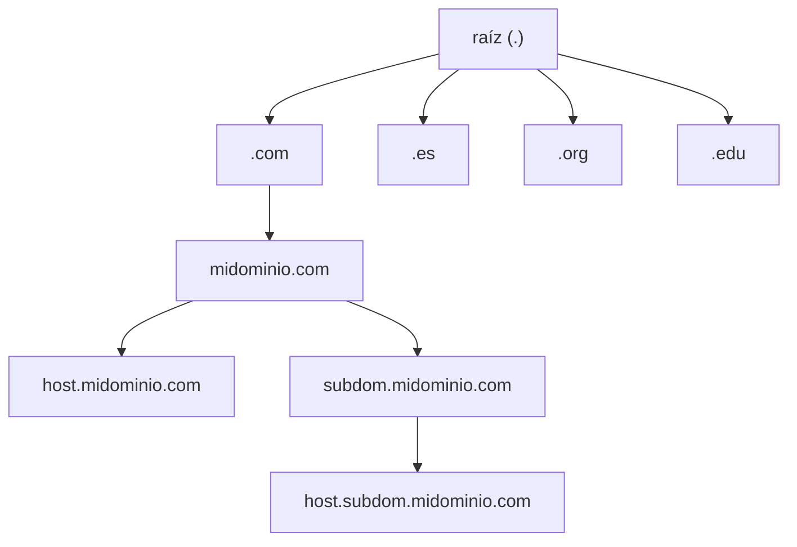
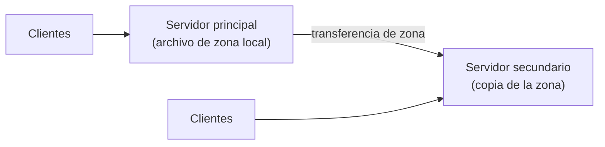

# Guía de DNS (Domain Name System)

Guía práctica para entender qué es el DNS, cómo resuelve nombres, cómo se organiza, qué tipos de registros existen y cómo diagnosticarlo y protegerlo.

> Basada y reexplicada a partir del artículo de Arsys: [Servidor DNS: ¿Qué es y para qué sirve?](https://www.arsys.es/blog/dns-domain-name-system). Los diagramas de esta guía son propios y los renderiza GitHub automáticamente (Mermaid). Las secciones marcadas con 🆕 amplían el artículo original.

## Índice

1. [¿Qué es el DNS?](#1-qué-es-el-dns)
2. [Cómo funciona la resolución de nombres](#2-cómo-funciona-la-resolución-de-nombres)
3. [Estructura: el árbol DNS](#3-estructura-el-árbol-dns)
4. [Servidores de nombres y zonas](#4-servidores-de-nombres-y-zonas)
5. [Tipos de registros DNS](#5-tipos-de-registros-dns)
6. [Configuración y gestión](#6-configuración-y-gestión)
7. [Herramientas de diagnóstico](#7-herramientas-de-diagnóstico)
8. [Seguridad DNS](#8-seguridad-dns)
9. [Chuleta rápida](#9-chuleta-rápida)

---

## 1. ¿Qué es el DNS?

Los equipos se identifican en Internet mediante **direcciones IP** (por ejemplo `216.32.74.52`), pero a las personas nos resulta mucho más fácil recordar **nombres** (`www.arsys.es`). El **DNS (Sistema de Nombres de Dominio)** es el sistema que **traduce nombres de dominio a direcciones IP** y viceversa.

Además de ser más cómodo, el nombre es más estable: la IP de un servidor puede cambiar por muchos motivos, pero el nombre sigue siendo el mismo y basta con actualizar a qué IP apunta.

Se usa para prácticamente todo lo que haces en red: navegar, enviar y recibir correo, jugar online, ver vídeo en streaming...

### 📜 Un poco de historia: el archivo HOSTS

Antes del DNS, los nombres se resolvían con un archivo de texto llamado **HOSTS**, con una lista de nombres y sus IP. En Internet ese archivo lo mantenía **un único equipo** y todos los demás descargaban copias periódicamente. Al crecer el número de equipos, ese sistema centralizado se volvió inviable, y por eso nació el DNS: una base de datos **distribuida y jerárquica**.

> 💡 El archivo `hosts` sigue existiendo hoy en tu equipo y se consulta antes que el DNS:
> - Linux / macOS: `/etc/hosts`
> - Windows: `C:\Windows\System32\drivers\etc\hosts`

---

## 2. Cómo funciona la resolución de nombres

La **resolución de nombres** es el proceso de convertir un nombre de dominio en una dirección IP.

### Versión simplificada

1. El usuario escribe un dominio en el navegador.
2. El navegador envía una consulta a un servidor DNS.
3. El servidor DNS busca el nombre en su base de datos.
4. Si lo encuentra, devuelve la IP.
5. El navegador usa esa IP para conectarse al sitio web.



### 🆕 Versión real: consultas recursivas e iterativas

En la práctica, el servidor DNS que te atiende (normalmente el de tu operador, el de tu empresa o uno público como `1.1.1.1` u `8.8.8.8`) **no suele conocer la respuesta**. Tiene que preguntar por la jerarquía hasta encontrar el servidor **autoritativo** del dominio:



- **Consulta recursiva:** el cliente pide al servidor que le devuelva la respuesta completa, sin preocuparse de cómo la consigue.
- **Consulta iterativa:** el servidor recibe una respuesta parcial ("pregunta a este otro") y sigue preguntando él mismo.

### 🆕 La caché y el TTL

Para no repetir todo este recorrido en cada consulta, los servidores **guardan las respuestas en caché** durante un tiempo llamado **TTL (Time To Live)**, en segundos. Ese TTL lo define el administrador del dominio en cada registro.

| TTL | Efecto |
|---|---|
| Bajo (por ejemplo 300 s) | Los cambios se propagan rápido, pero el servidor recibe más consultas. |
| Alto (por ejemplo 86400 s = 1 día) | Menos carga y más rendimiento, pero los cambios tardan más en verse. |

Por eso, cuando cambias la IP de un dominio, no todo el mundo lo ve al instante: cada caché mantiene la respuesta antigua hasta que caduca su TTL.

> 🆕 El DNS usa el **puerto 53**, normalmente por **UDP** (consultas normales) y por **TCP** (transferencias de zona y respuestas grandes).

---

## 3. Estructura: el árbol DNS

El DNS es una **base de datos distribuida con estructura de árbol**, llamada **espacio de nombres de dominio**. Cada nodo tiene un nombre y puede contener subdominios. El nombre completo se lee de **derecha a izquierda**, separando cada nivel con un punto.



- **Dominio:** cada nodo del árbol junto con todo lo que cuelga de él.
- Un dominio puede contener **equipos (hosts)** y **otros dominios (subdominios)**. Por ejemplo, `midominio.com` puede contener `host.midominio.com` (un equipo) y `subdom.midominio.com` (un subdominio que a su vez tiene equipos).
- Los nombres solo pueden usar los caracteres **`a-z`, `A-Z`, `0-9` y `-`**.

### Dominios de nivel superior (TLD)

La raíz de la jerarquía está gestionada a nivel mundial por **IANA/ICANN** (el artículo original habla del *Internet Network Information Center*). Los dominios superiores se asignan a organizaciones y países:

| Dominio | Tipo de organización |
|---|---|
| `.com` | Comercial |
| `.edu` | Educativo |
| `.org` | Organizaciones no comerciales |
| `.es`, `.fr`, `.de`... | Códigos de país (dos letras) |

---

## 4. Servidores de nombres y zonas

Los servidores DNS que almacenan información del espacio de nombres se llaman **servidores de nombres**.

- Un servidor de nombres suele ser responsable de **una o varias zonas**.
- Una **zona** es un archivo (el *archivo de zona*) que contiene los registros de una parte del espacio de nombres.
- Se dice que el servidor tiene **autoridad** sobre esas zonas.

> Cada línea del archivo de zona es un **registro de recurso (RR)**.

### Servidor principal y secundario

| Tipo | Cómo obtiene los datos |
|---|---|
| **Principal (primario / maestro)** | Lee la zona de **archivos locales**. Los cambios (añadir un dominio, un registro...) se hacen aquí. |
| **Secundario (esclavo)** | Copia la zona **por red** desde otro servidor con autoridad, normalmente el principal. |

La copia de la zona por red se llama **transferencia de zona**.

**¿Para qué sirve el secundario?** Para **redundancia**. Se necesitan **al menos dos servidores** por zona, para que si uno falla, el otro siga respondiendo.



---

## 5. Tipos de registros DNS

El archivo de zona contiene los datos necesarios para resolver las peticiones del dominio. Estos son los registros más importantes:

| Registro | Nombre | Para qué sirve |
|---|---|---|
| **A** | Address | Nombre → dirección **IPv4** |
| **AAAA** | IPv6 Address | Nombre → dirección **IPv6** |
| **CNAME** | Canonical Name | **Alias** de otro nombre |
| **MX** | Mail eXchange | Servidor de **correo** del dominio |
| **NS** | Name Server | Servidores de nombres **con autoridad** de la zona |
| **SOA** | Start of Authority | Datos administrativos de la zona |
| **TXT** | Text | Texto libre (verificaciones, SPF, DKIM...) |
| **SRV** | Service | **Servidor y puerto** de un servicio concreto |
| **PTR** | Pointer | Resolución **inversa**: IP → nombre |

### Registro A

Asocia un nombre con una IPv4. Formato:

```
nombre   IN  A   direccionIP
```

```
machine1          IN  A   157.55.201.143
nombreservidor2   IN  A   157.55.200.2
```

### Registro AAAA

Lo mismo que el A pero con **IPv6**, cada vez más habitual conforme IPv6 sustituye a IPv4.

```
mi-sitio-web   IN  AAAA   2001:0db8:85a3:0000:0000:8a2e:0370:7334
```

### Registro SOA

Es siempre el **primer registro** de cualquier archivo de zona. Contiene información de gestión de la zona:

| Campo | Significado |
|---|---|
| **Host origen** | Servidor donde se mantiene el archivo (el principal). |
| **Correo de contacto** | Email del responsable de la zona. **La `@` se sustituye por un punto** (`admin.midominio.com.` = `admin@midominio.com`). |
| **Número de serie** | Versión del archivo. **Debe aumentar cada vez que lo modificas**, si no los secundarios no se enteran del cambio. |
| **Refresh (actualización)** | Cada cuántos segundos comprueba el secundario si hay cambios en el principal. |
| **Retry (reintento)** | Cuánto espera el secundario para reintentar una transferencia fallida. |
| **Expire (caducidad)** | Cuánto tiempo sigue intentando el secundario descargar la zona antes de descartar sus datos antiguos. |
| **TTL** | Tiempo máximo que se puede guardar en caché un registro de la zona. |

Ejemplo (los saltos de línea se permiten dentro de paréntesis):

```
@   IN  SOA  ns1.midominio.com.  admin.midominio.com. (
        1        ; número de serie
        10800    ; refresh   [3 horas]
        3600     ; retry     [1 hora]
        604800   ; expire    [7 días]
        86400 )  ; TTL       [1 día]
```

> En un archivo de zona, `@` representa el **dominio raíz de la zona**. 🆕 Nota: en versiones modernas de BIND, el último campo del SOA es el TTL de la **caché negativa** (respuestas "no existe"), y el TTL por defecto de la zona se define con la directiva `$TTL`.

### Registro NS

Indica qué servidores de nombres tienen autoridad sobre el dominio, para que otros servidores sepan a quién preguntar.

```
@   IN  NS   ns3.servidoresdns.net.
@   IN  NS   ns4.servidoresdns.net.
```

### Registro MX

Indica qué servidor gestiona el **correo** del dominio. Si hay varios, se prueba primero el de **menor número** (mayor prioridad) y, si no está disponible, el siguiente.

```
@   IN  MX  10  servidorcorreo0
@   IN  MX  20  servidorcorreo1
```

Con estos registros, el correo para `prueba@midominio.com` va primero a `servidorcorreo0.midominio.com` y, si falla, a `servidorcorreo1.midominio.com`.

> ⚠️ El destino de un MX debe ser un **nombre**, nunca una dirección IP.

### Registro CNAME

Crea un **alias**: varios nombres apuntando a un mismo equipo. Es útil, por ejemplo, para tener un servidor FTP y otro web en la misma máquina.

```
servidorarchivos   IN  A       157.55.200.41
ftp                IN  CNAME   servidorarchivos
www                IN  CNAME   servidorarchivos
```

Así, `www.midominio.com` y `ftp.midominio.com` resuelven a la misma IP y, si la IP cambia, solo hay que tocar el registro A.

### Registro TXT

Almacena **texto arbitrario**. Se usa para información de contacto, metadatos y, sobre todo, para **verificar la propiedad de un dominio** y funciones de seguridad de correo (SPF, DKIM, DMARC).

```
mi-sitio-web.com   IN  TXT   "Este es mi sitio web"
```

### Registro SRV

Indica la **dirección y el puerto** de un servicio concreto (VoIP, mensajería, Active Directory...).

| Campo | Ejemplo |
|---|---|
| Nombre | `mi-sitio-web.com` |
| Prioridad | 10 |
| Peso | 5 |
| Puerto | 5060 |
| Destino | `sipserver.mi-sitio-web.com` |

### 🆕 Registro PTR

Es la **resolución inversa**: dada una IP, devuelve el nombre. Se guarda en zonas especiales `in-addr.arpa` (IPv4). Se usa mucho en servidores de correo y en registros de logs.

```
143.201.55.157.in-addr.arpa.   IN  PTR   machine1.midominio.com.
```

---

## 6. Configuración y gestión

### Puesta en marcha de un servidor DNS

1. **Instalar** un servidor DNS. Hay muchas opciones, gratuitas y de pago (por ejemplo **BIND** en Linux o el rol DNS de **Windows Server**).
2. **Configurarlo** para que sirva la **zona** de tu organización. Recuerda: la zona es el conjunto de registros de un dominio concreto.

### Registro y mantenimiento del dominio

1. **Registra el dominio** en un registrador. Así queda constancia de la propiedad y te proporciona los servidores de nombres del dominio.
2. **Mantén actualizados los registros.** Por ejemplo, si cambia la IP del servidor web, hay que **actualizar su registro A**. Se puede hacer manualmente o con una herramienta de gestión de DNS.

### 🆕 Ejemplo mínimo de zona (BIND)

```
$TTL 86400
@       IN  SOA  ns1.midominio.com.  admin.midominio.com. (
                 2026092801 ; serie (formato AAAAMMDDNN)
                 10800      ; refresh
                 3600       ; retry
                 604800     ; expire
                 86400 )    ; TTL negativo

        IN  NS   ns1.midominio.com.
        IN  MX   10 mail.midominio.com.

ns1     IN  A      192.168.56.10
mail    IN  A      192.168.56.11
www     IN  A      192.168.56.12
ftp     IN  CNAME  www
```

> 💡 **Para practicar en tu laboratorio:** monta un servidor DNS en una VM Linux con BIND y usa una red **Host-only** o **Internal Network** de VirtualBox para que las demás VM lo usen como servidor DNS. Es un montaje ideal para probar zonas, registros y transferencias sin tocar tu red real. Puedes verlo junto con la [guía de redes de VirtualBox](./virtualbox-redes.md).

---

## 7. Herramientas de diagnóstico

Si un usuario no puede acceder a una web, muchas veces el problema es de DNS. Estas son las herramientas habituales:

| Herramienta | Para qué sirve |
|---|---|
| **nslookup** | Consultas directas a servidores DNS para obtener información y detectar problemas. Disponible en Windows, Linux y macOS. |
| **dig** | Exploración en profundidad de registros DNS. Es la más flexible y detallada. |
| **host** | Parecida a nslookup, con detalles adicionales, como los servidores de nombres autorizados de un dominio. |
| **mtr** | "My Traceroute": sigue la ruta del tráfico y ayuda a detectar problemas de conectividad hacia el servidor DNS. |
| **ping** | Comprueba la conectividad y la latencia con un servidor (no es específica de DNS). |
| **whois** | Consulta los datos de registro de un dominio (no es de diagnóstico, pero es útil). |

### 🆕 Ejemplos de uso

```bash
# Resolver un nombre (IPv4)
nslookup www.arsys.es

# Preguntar a un servidor DNS concreto
nslookup www.arsys.es 8.8.8.8

# Consultar un tipo de registro
nslookup -type=MX arsys.es
dig arsys.es MX

# Respuesta corta con dig
dig +short www.arsys.es A

# Seguir toda la cadena de resolución desde la raíz
dig +trace www.arsys.es

# Resolución inversa
dig -x 8.8.8.8

# Ver los servidores de nombres de un dominio
host -t NS arsys.es

# Datos de registro del dominio
whois arsys.es
```

### 🆕 Vaciar la caché DNS

```bash
# Windows
ipconfig /flushdns

# macOS
sudo dscacheutil -flushcache; sudo killall -HUP mDNSResponder

# Linux (systemd-resolved)
sudo resolvectl flush-caches
```

---

## 8. Seguridad DNS

Sin un DNS seguro, los usuarios podrían ser redirigidos a sitios maliciosos o quedarse sin acceso a los recursos que necesitan.

### DNSSEC

**DNSSEC (Domain Name System Security Extensions)** es un conjunto de extensiones que añade **firmas digitales** a los registros DNS. Así se puede verificar que las respuestas **no han sido modificadas ni falsificadas** por el camino. Su objetivo principal es prevenir la manipulación del DNS.

> 🆕 DNSSEC garantiza **autenticidad e integridad**, pero **no cifra** las consultas. Para eso existen **DNS over HTTPS (DoH)** y **DNS over TLS (DoT)**.

### Amenazas más comunes

| Amenaza | Qué es |
|---|---|
| **Spoofing / envenenamiento de caché** | El atacante hace que los usuarios reciban respuestas falsas y los redirige a webs maliciosas (phishing, malware, robo de datos). |
| **Ataque DDoS** | Se inunda el servidor DNS con peticiones hasta que no puede responder. |

### Medidas de protección

- Implementar **DNSSEC**.
- Usar **servidores DNS de confianza**, probados y certificados.
- Aplicar **firewalls y filtrado DNS** para bloquear tráfico malicioso y consultas sospechosas.
- **Monitorizar** el tráfico DNS para detectar cambios inusuales.
- **Actualizar y parchear** los servidores para evitar vulnerabilidades.
- 🆕 Restringir las **transferencias de zona** solo a los servidores secundarios autorizados.

---

## 9. Chuleta rápida

| Quiero... | Uso |
|---|---|
| Traducir nombre → IPv4 | Registro **A** |
| Traducir nombre → IPv6 | Registro **AAAA** |
| Crear un alias | Registro **CNAME** |
| Definir el servidor de correo | Registro **MX** |
| Indicar los servidores de nombres del dominio | Registro **NS** |
| Datos administrativos de la zona | Registro **SOA** |
| Verificar dominio / SPF / DKIM | Registro **TXT** |
| Localizar un servicio con puerto | Registro **SRV** |
| Traducir IP → nombre | Registro **PTR** |
| Comprobar una resolución | `nslookup` / `dig` |
| Ver los datos de un dominio | `whois` |

**Ideas clave para recordar:**

- El DNS es una **base de datos distribuida y jerárquica**, no un único servidor.
- La resolución sigue la jerarquía **raíz → TLD → servidor autoritativo**, y las respuestas se guardan en **caché** según su **TTL**.
- Cada zona necesita **al menos dos servidores** (principal y secundario) por **redundancia**.
- Cada vez que modifiques una zona, **incrementa el número de serie del SOA**.

---

*Fuente principal: [Arsys – Servidor DNS: ¿Qué es y para qué sirve?](https://www.arsys.es/blog/dns-domain-name-system). Secciones marcadas con 🆕 añadidas como ampliación.*
